# VitalView

## Contexto
O VitalView é um projeto fullstack acadêmico desenvolvido pelos alunos do 2º semestre do 1º ano do curso de Bacharelado em Ciências da Computação da faculdade SPTech School.

O objetivo como turma é integrar, de forma prática e contínua, os conteúdos estudados ao longo do semestre, com o projeto sendo desenvolvido paralelamente às aulas.

Neste semestre, o tema do projeto foi sobre monitoramento de hardware e processos. O sistema é responsável por coletar métricas de sobre o tema escolhido pelo grupo, desde que tenha sido aprovado pelos professores de Pesquisa e Inovação (PI) - como CPU, RAM, disco, rede etc -, fazer um processamento e gerar insights ao usuário final. Dependendo do negócio, um monitoramento que não esteja dentro do escopo também é bem-vindo, com a condição de que atenda ao tema escolhido e gere valor ao usuário.

## Como funciona o modelo de desenvolvimento?
O semestre é divido em três sprints, seguindo a metodologia ágil scrum, onde cada sprint representa a reunião com o professor, que no dia ele atua como o "cliente" que está comprando seu produto.

Na segunda sprint, houve uma mudança nos temas onde cada grupo passou a dar continuidade no projeto até o final.

## O tema abordado
O tema escolhido foi o monitoramento em servidores on-premises hospitalares, com foco em disco.

Nele, coletamos informações menciondas anteriomente: CPU, RAM, disco e além de propriedades de imagens. As métricas não se limitam somente ao seu uso, mas também informações de desempenho, análises e projeções a partir do processamento delas.

## Arquitetura e ferramentas
As técnologias utilizadas foram:

### Linguagens:
- Python - para pegar dados da máquina
- R - para análise de dados
- Java - para ETL (extrair, transformar e carregar) dos arquivos
- MySQL - para o banco
- HTML, CSS e Javascript + Node - para o front-end
  
### Infra:
- AWS
  - EC2 - para hospedar o site e o banco
  - S3 - para datalake e disponibilização dos dados
  - Lambda - para acionar a ETL
- Docker - para conteinerização do site e banco

### Outras técnologias:
- Integração com Jira e Slack - para abrir chamados e reportar alertas

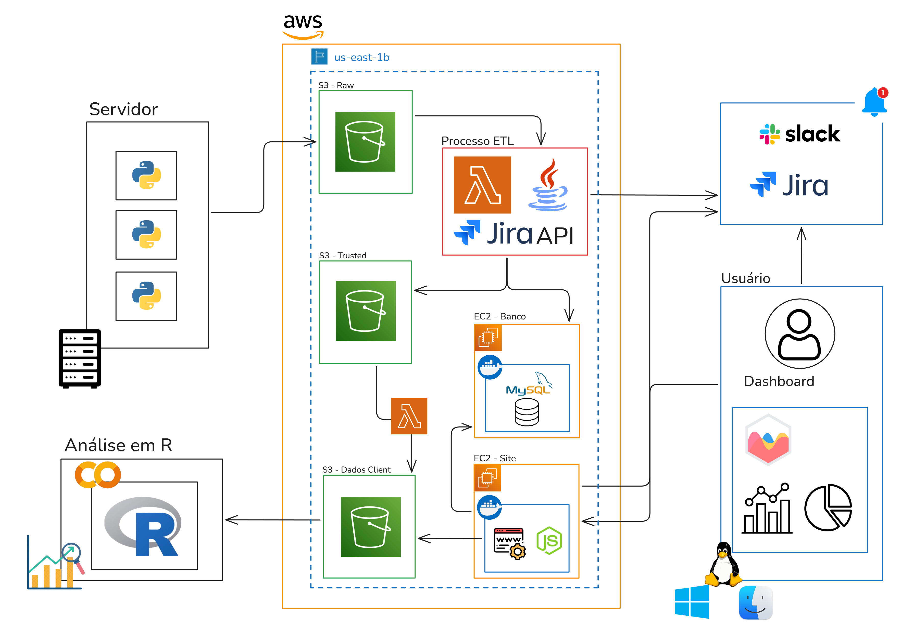

Antes de exemplificar como funciona o fluxo de dados detalhadamente, é importante esclarecer uma coisa: cada dashboard foi desenvolvida por um integrante do grupo, seguindo as orientações dos professores. Portanto, o processo da captura, envio do arquivo até o consumo dos dados variar entre as implementações. Entretanto, todos seguem a mesma rota em comum: captura -> envio -> processamento -> plotagem.

1. **Geração de arquivo**  
   O python gera o arquivo das informações do hardware em formato csv, com o seguinte padrão de nomeclatura: idServidor_nomeServidor_hospital.csv. Por exemplo: 1_srv1_hsl.csv.

2. **Envio ao bucket**  
   O arquivo é então enviado ao bucket raw, servindo de datalake para todos os arquivos que estão chegando.

3. **Primeira ETL**  
   O bucket é servido como um trigger para a lambda "raw-to-trusted", que pega o arquivo do bucket, converte para JSON e envia ao bucket trusted.

4. **Segunda ETL**  
   Este bucket também serve como um trigger para a segunda lambda "trusted-to-client", que pega o arquivo, faz o tratamento necessário, gera um arquivo JSON de relatório e envia ao bucket client. Aqui também é feito o uso do banco de dados para analisar parametrizações e enviar alertas para o banco e o Jira.

5. **Consumo dos dados**  
   Cada dashboard possui seu próprio JSON para ser consumido. Logo, a segunda ETL também gera vários arquivos JSON para atender cada uma dessa dashboard. Isso permite que cada tela do site que exibe a dashboard busca por um arquivo diferente dentro do bucket.

## Screenshots do site
- **Página inicial**  
  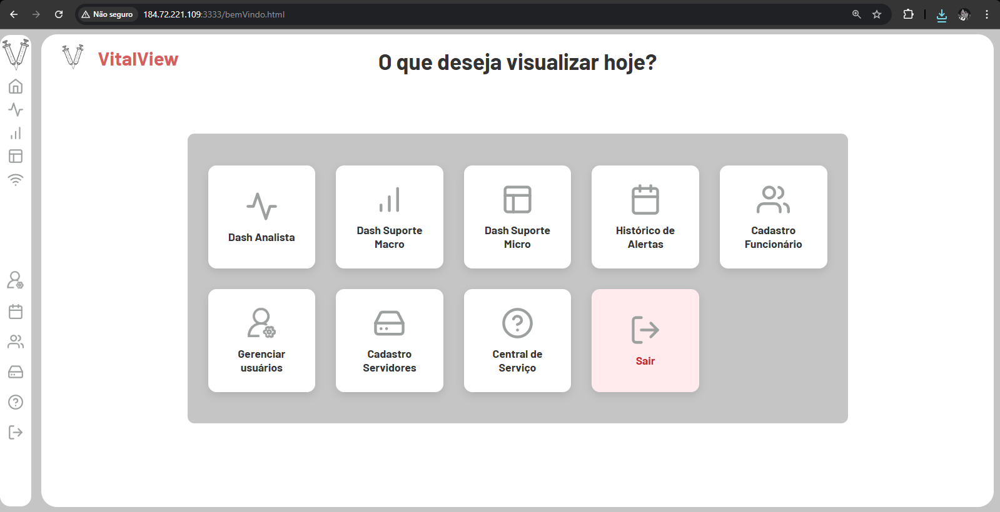

- **Cadastros**
  - Usuários  
    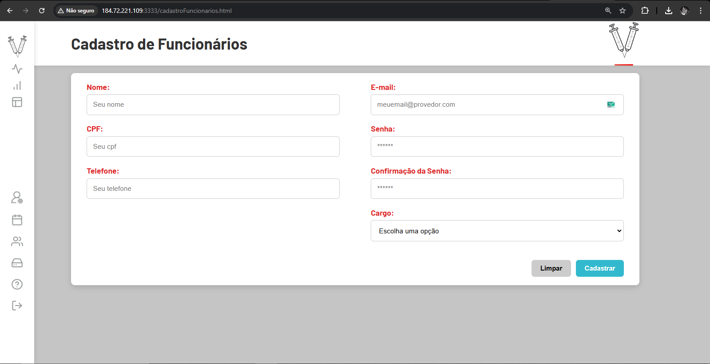

  - Servidores  
    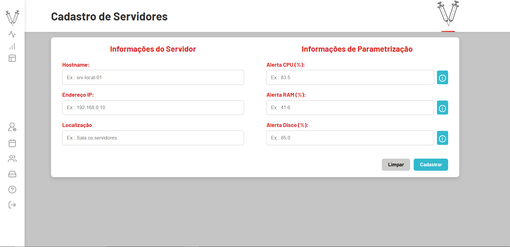

- **Dashboards**
  - Analista  
    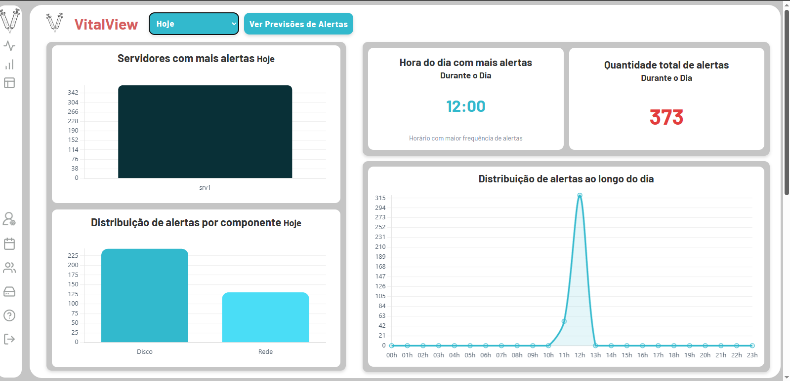  
    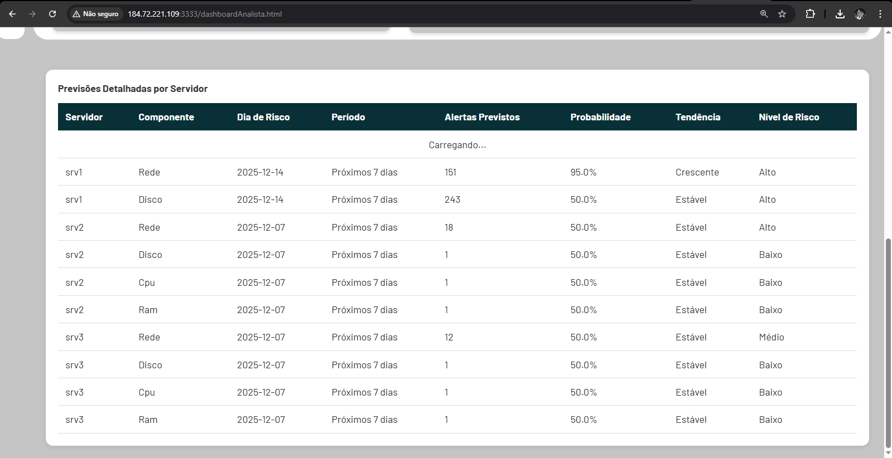

  - Suporte macro  
    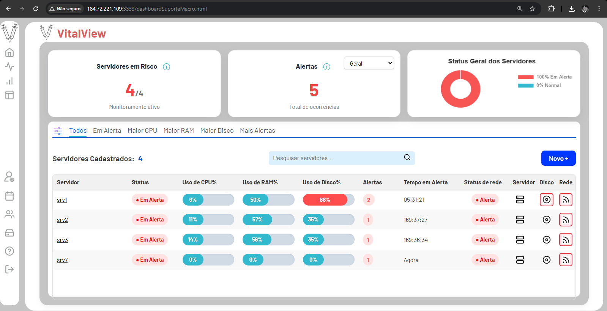

  - Suporte micro  
    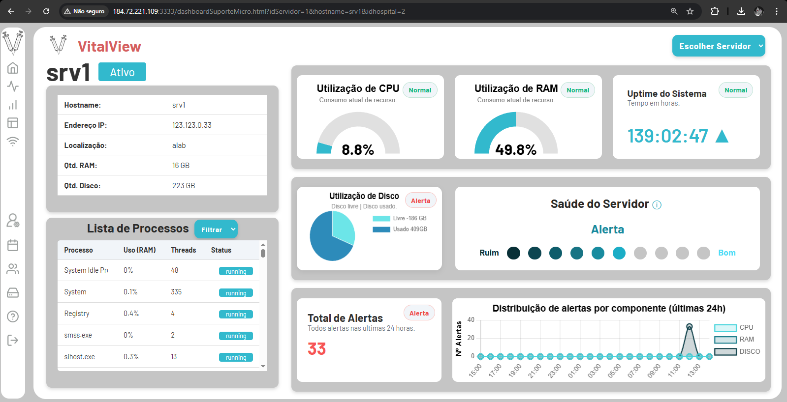

  - Suporte rede  
    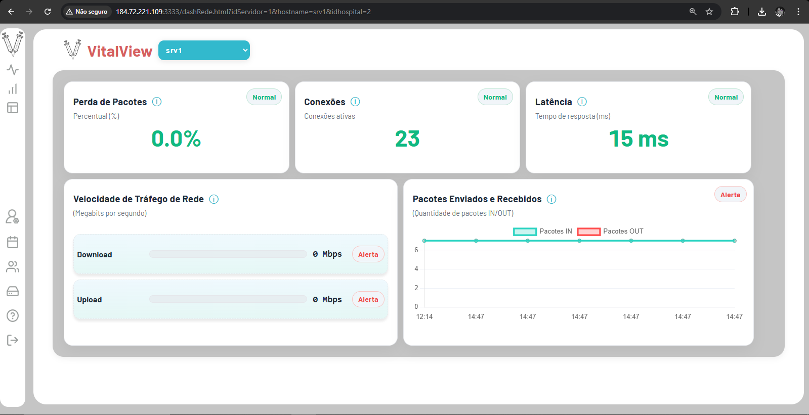

  - Suporte disco  
    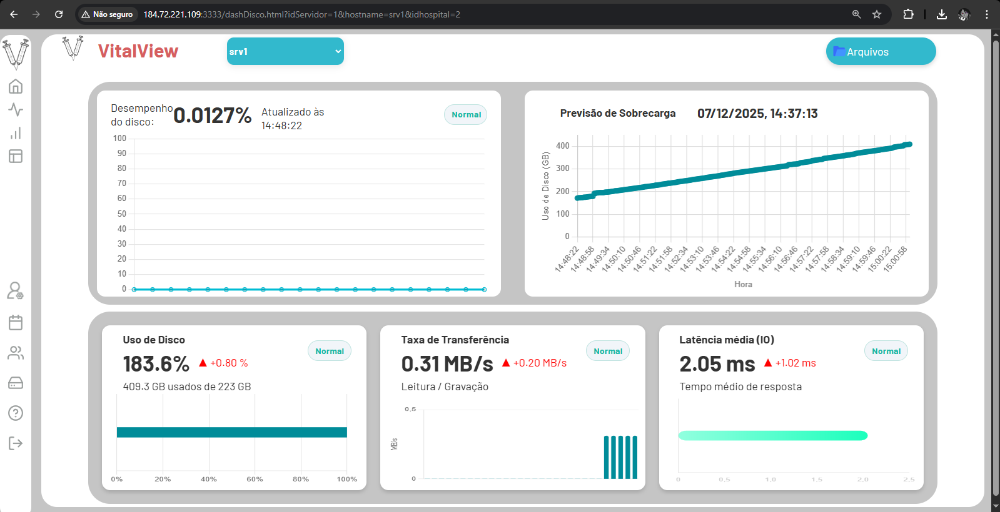

  - Suporte ger. imagens  
    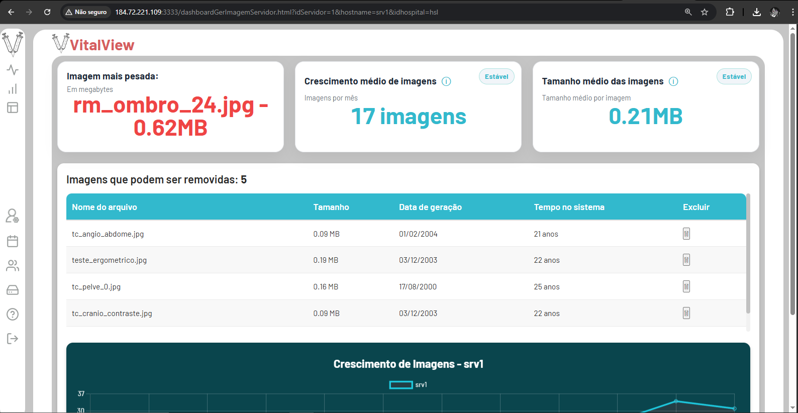  
    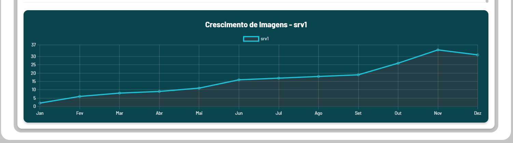

  - Histórico de alertas  
    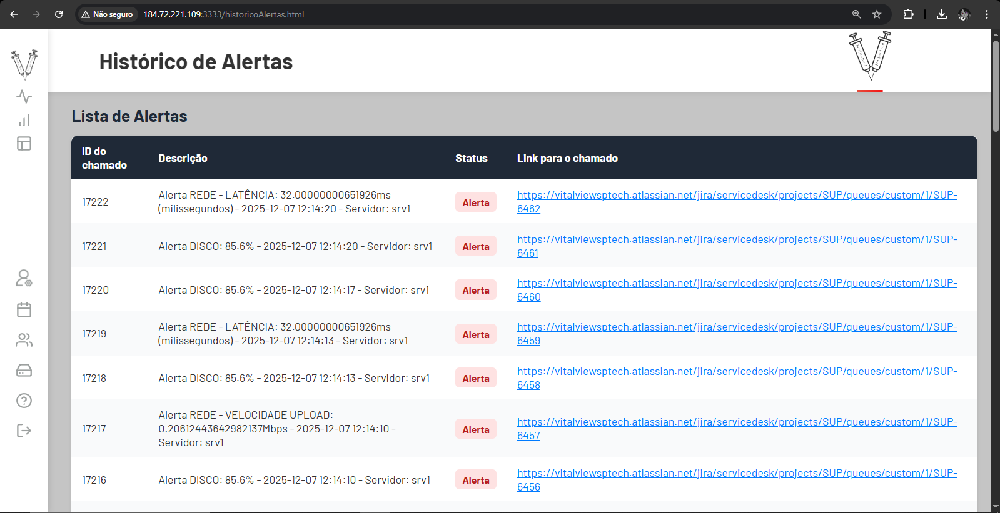

## Encerramento
Infelizmente, não é possível rodar o projeto, pois a infraestrutura que estava em uma das contas da AWS Academy foi expirada, e perdeu-se toda a infra. Portanto anexei algumas imagens Apesar disso, há um vídeo no YouTube mostrando um pouco na prática como funciona o site, até questões técnicas:

https://youtu.be/Ysmo4KYspno

